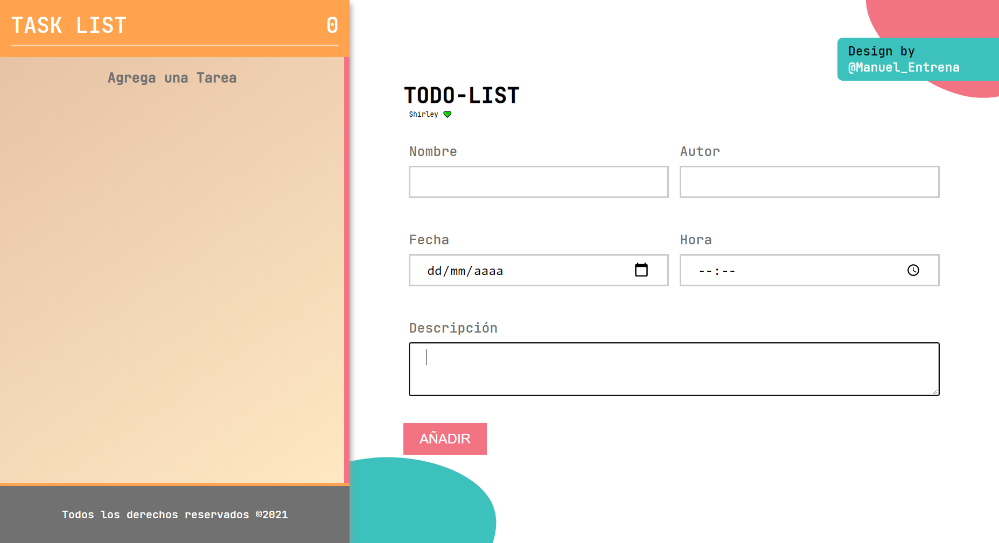

# TODO-LIST

Proyecto todo-list creado con [Create React App](https://github.com/facebook/create-react-app).

## Descripción

Crear una app de tareas con el cual trabajar con hooks (useState, useEffect) para gestionar el estado de la aplicación.

Usamos LocalStorage para almacenar en cache las tareas y se guarde después de un refresh del navegador.

## Autor

- Manuel Entrena Jiménez

Lider de este proyecto

## Scripts Habilitados

En este proyecto tu puedes correr:

### `npm start`

Runs the app in the development mode.\
Open [http://localhost:3000](http://localhost:3000) to view it in the browser.

The page will reload if you make edits.\
You will also see any lint errors in the console.

### `npm run build`

Builds the app for production to the `build` folder.\
It correctly bundles React in production mode and optimizes the build for the best performance.

The build is minified and the filenames include the hashes.\
Your app is ready to be deployed!

See the section about [deployment](https://facebook.github.io/create-react-app/docs/deployment) for more information.
